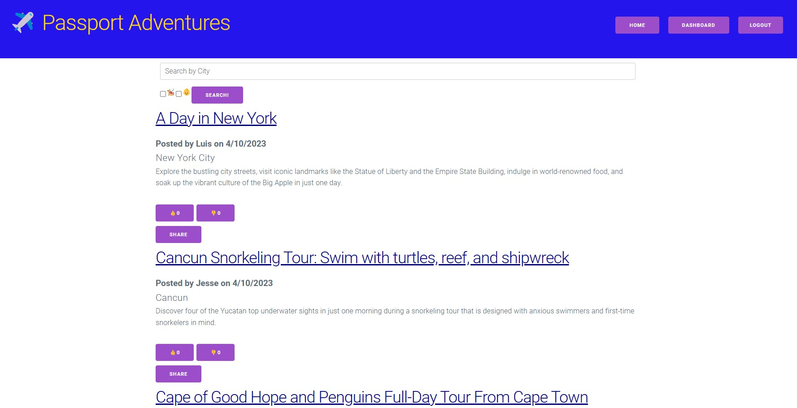
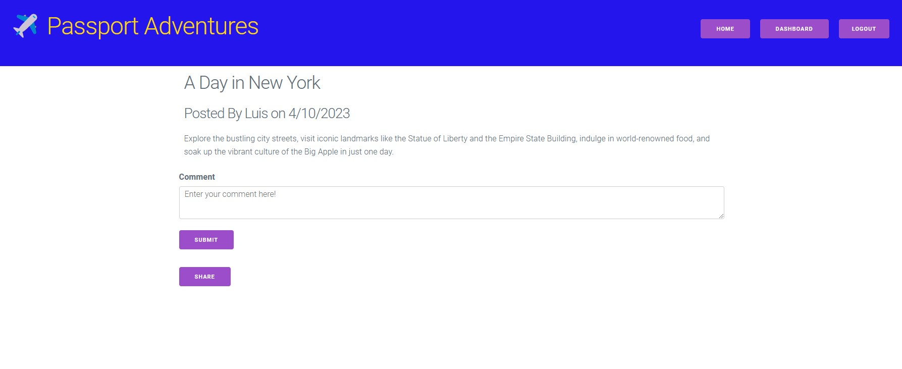
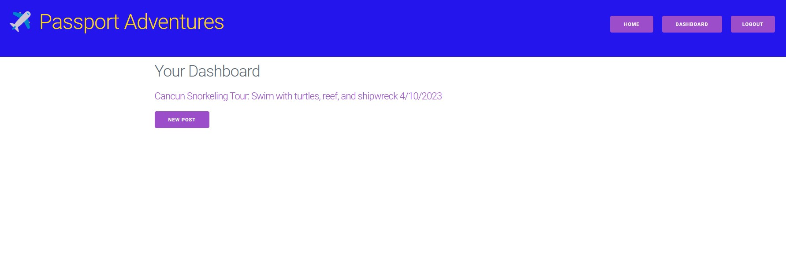

# Passport Adventures

## Description

As lovers of travel, we wanted a place that users could go to share their trips. In addition, we wanted it to be available to confirm if a place is pet friendly and / or family friendly, and have a search functionality for users to filter through the posts made in the blog / forum. Finally, we wanted the ability to share these posts via email so users could make a note of where they may want to travel.

## Table of Contents

- [Installation](#installation)
- [Technology Used](#technology-used)
- [Usage](#usage)
- [License](#license)
- [Questions and Contributing](#questions-and-contributing)
- [Tests](#tests)

## Installation

No installation is required for the user to make use of the application from the deployed site.

## Technology Used

The application follows the MVC paradigm in its architectural structure, using Handlebars.js as the templating language, SQL as the ORM, and express-session npm package for authentication.

Technologies used are as follows:

 - Node.js
 - MySQL2
 - Sequelize
 - Express
 - Dotenv
 - Heroku for deployment
 - Nodemailer for sharing posts
 - Cloudinary for image upload
 - Milligram as the CSS framework

## Usage

When the user pulls up the webpage, they will see 3 posts from the seed data. If the user then tries to click one of the posts, they will be prompted to log in or sign up. Once the user is logged in, they can view their dashboard where they will be able to create a new post.

With the creation of any post, they can enter the city, select family friendly and / or pet friendly, enter in the content, and upload an image URL.

If a post is created, the user will be able to click the post and update or delete it. From any post, the user will have the ability to share via email.

Finally, the user will be able to comment and like & dislike any post that isn't theirs.

### Homepage:

### Login Page:

### Post Page:

### Dashboard:

### Dashboard Post Page:

### New Post Page:

## License

[The MIT License](https://opensource.org/licenses/MIT)

## Questions and Contributing

This project was created by Luis Lopez, Ani Stone, & Jesse Lungren. If you have any questions, you can contact us through GitHub at:

- [Luis](https://github.com/ll8719)
- [Ani](https://github.com/anistone9)
- [Jesse](https://github.com/jmcdlungren)

If you are interested in contributing, please follow the guidelines outlined within the [Contributor Covenant](https://www.contributor-covenant.org/).

## Tests

N/A